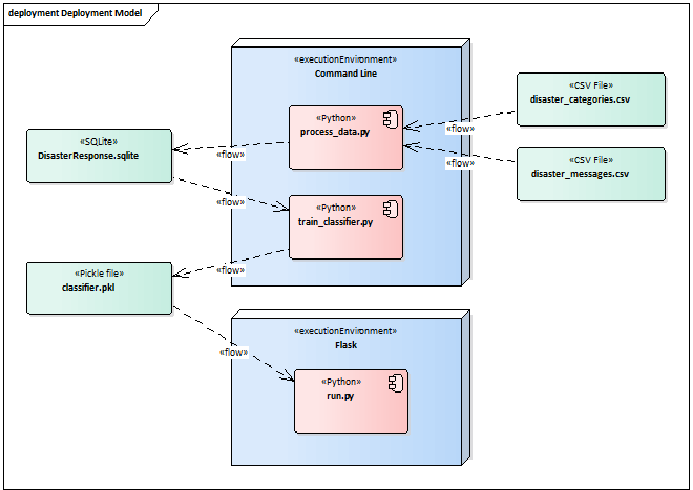

# Disaster Response Pipeline
Python code for a disaster response pipeline.

## Table of Contents

1. [Installation](#installation)
2. [Project Motivation](#motivation)
3. [Directory Structure](#directoryStructure)
4. [Design](#design)
5. [Results](#results)

## Installation 

This project was written in Python 3.7. The relevant Python packages for this project are as follows:

- sys
- logging
- numpy
- pandas
- matplotlib
- plotly
- json
- nltk.stem
- nltk.tokenize
- flask
- sqlalchemy
- sklearn.externals
- sklearn.model_selection

## Project Motivation 

## Directory Structure 

- Root /

    - README.md  
    - app /
        - templates /
            - go.html
            - master.html 
        - run.py  
    - data /  
        - disaster_categories.csv  
        - disaster_messages.csv  
        - process_data.py  
    - tests /  
        - all_tests.py  
        - process_data_test.py  
        - train_classifier_test.py  
        - unittest_disaster_categories.csv  
        - unittest_disaster_messages.csv  
    - models /  
        - train_classifier.py  
        - classifier.pkl  
    - uml /
        - Use cases.png  

## Design 

### Main Uses Cases
There are 3 main use cases:

- Import data
- Train model
- Classify message

    

### Components and Dataflow

There are 3 main components:

- process_data.py  
- train_classifier.py  
- run.py  

    

#### process_data.py
Running process_data.py loads data from the messages and categories csv file and
persists this data into a SQLite database. Any existing database file
will be overwritten. Log messages are written both to the console and
a dedicated log file named process_data.log.

The following sequence of actions is executed:
- Load data csv files  
- Clean the data  
- Save the data into a SQLite database  

#### train_classifier.py

Running train_classifier.py creates either a new classifier.pkl file or overwrites an existing file.

The following sequence of actions is executed:
- Load data from database  
- Build a machine learning model  
- Train the model  
- Evaluate the model   
- Persist the model as a pickle file  

#### run.py

This is a web application using the Flask framework. During startup the application loads both the machine learning model from the pickle file and messages from the SQLite database.

## Results 
